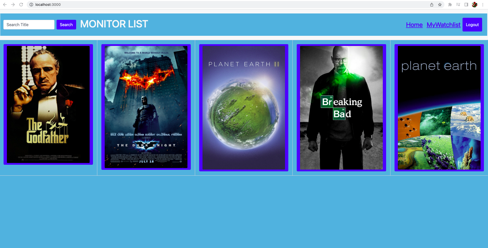

# MONITOR-LIST

## Descriptions

Monitor List is a full-stack web application created by using React, GraphQL, Bootstrap, JavaScript, Nodejs, Expressjs, and IMDb server-side API.

With this app the user can sign-up, login, search for favorite movies, and TV shows. User can save their favorite movies and TV shows to their watchlist by simply clicking on the save button. User can also see their saved items in the watchlist and can remove and update items from the watchlist.

## Table of Contents

- [Installation](#Installation)
- [Application Screenshot](#Screenshot)
- [Heroku Link](#Heroku)
- [License](#License)
- [Questions](#Questions)

## Installation

Clone the monitor-list repository to your local computer. Run `npm install`, `npm run install`, `npm run seed` and `npm run develop` in the command line (Windows) or terminal on (Mac) to install the dependencies and run the application.

[Deployed Application Link](https://monitor-list.herokuapp.com/)

## License

This Application is covered under MITLicense

For more information about the License visit [MIT License Page](https://choosealicense.com/licenses/mit/)

## Contributors

- Lucas Garcia: [https://github.com/lgarcia196](https://github.com/lgarcia196)
- Ryan Saldaen: [https://github.com/Rsaldaen](https://github.com/Rsaldaen)
- Phillip Stevenson: [https://github.com/OsideSILENCER](https://github.com/OsideSILENCER)
- Mohammad Nabi Noorzai: [https://github.com/mnoorzai21](https://github.com/mnoorzai21)
